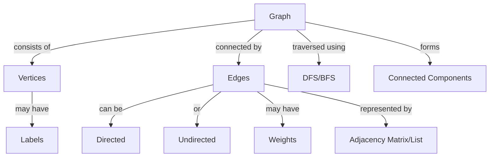
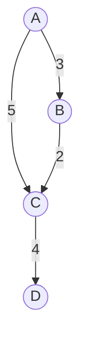

## Graph Data Structure

### Types of graphs

1. Weighted graphs

Graph whose edges or path have weights

2. Unweighted graphs

All edges have equal weights.

3. Directed Graphs

Edges are directed from one none to another. For example - Flights Routes, Flight Fares.

4. Undirected Graph

all edges are bi-directional
For example - Friends connected in faceboook.

### Storing a Graph

1. Adjacency Matrix

- need to traverse a row to get all neighbors.
- O(1) to check an edge between two rows
- Takes o(n squared) memory

2. Adjacency List

- Easly get all neighbors
- O(n) on neighbors to find the edge
- Takes linear memory.

### Adjancey Lit
