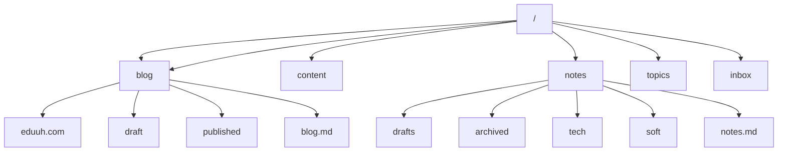

# Eduuh's Byte Safari

This repository is designed to store my public notes, public blog
related source code together.

The top level folder structure is as follows.

Content is the obsidian vault.

## The idea

**Knowledge Hub/Repository:** This is a growing Obsidian vault;
it stores notes in Markdown, & mdx format. Topics covered are.

1. DSA - in different programming languages
2. Neovim Configuration
3. Command line interface tools (workflows)
4. Note Taking
5. Mathematics
6. Hobbies - Motorcycles & Cars

### Data Structures & Algorithms (DSA)

> Goals

- Solve problems in single files with reusable, cross-language test cases.
- Practice in multiple languages to learn new skills.
- Continuously add new solutions and refine old ones.
- Use [Neovim DAP](https://github.com/mfussenegger/nvim-dap) for quick debugging.

> Future Enhancements

- Automate question downloads and solution submissions
  for platforms like [LeetCode](https://leetcode.com) and [Codeforces](https://codeforces.com).
- Set up templates for competitive programming.
- Add code runners and visualization tools to enhance learning and blogging.

### Neovim Configuration

> Goals

- Test and improve the stability of the Neovim setup with plugins, themes, and settings.
- Maintain a lightweight and efficient configuration.

> Approach

- Use an isolated environment to test changes without affecting the main setup.
- Monitor performance and track changes using version control.

### 3. Competitive Programming

> Goals

- Regularly practice DSA problems to build skills.
- Review and optimize solutions for better performance.
- Participate in coding contests on platforms like [LeetCode]
  (<https://leetcode.com>) and [AtCoder](https://atcoder.jp/).

> Long-Term Vision

- Automate workflows for downloading, solving, and submitting problems via CLI.
- Develop proficiency in multiple languages for flexibility in problem-solving.

### Growth & Challenges

- Maintain versioned solutions to track progress and improvements.
- Organize solutions by topic (e.g., sorting, graphs, dynamic programming).
- Add documentation to make the repository a comprehensive reference.
- Introduce regular coding challenges to stay consistent.

### Related Repositories

1. [nvim Configuration](https://github.com/eduuh/nvim)
2. [dotfiles - Base Configuration](https://github.com/eduuh/dotfiles)
